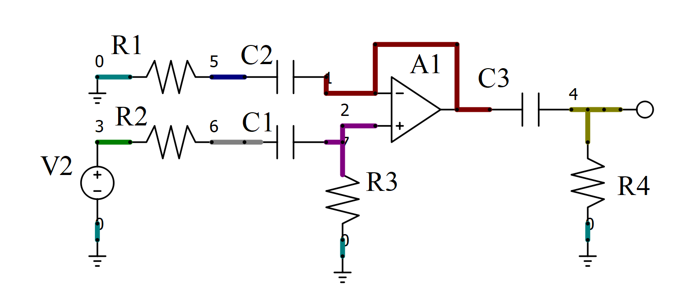

# Intro
Transfer functions calculated by QSapecNG

# Gain stage

## Raw
C2 * C3 * R1 * R4 * V2 * s^2 + C3 * R4 * V2 * s
***
C2 * C3 * R1 * R4 * s^2 + ( C2 * R1 + C3 * R4 ) * s + 1

## Digit
1 * s^2 + 10 * s
***
1 * s^2 + 110 * s + 1000

